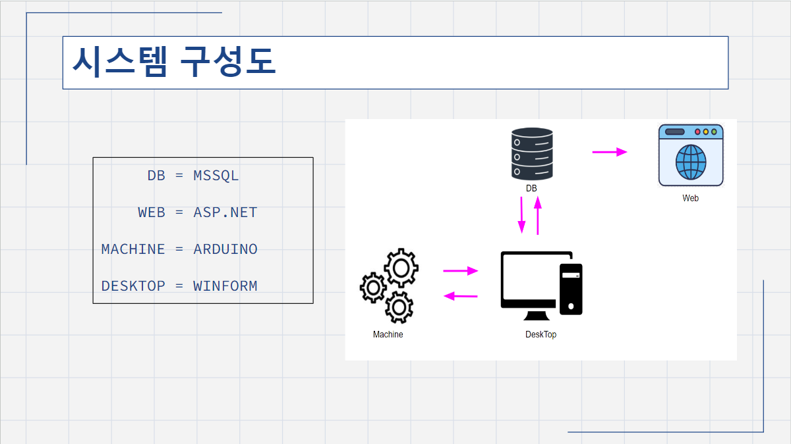
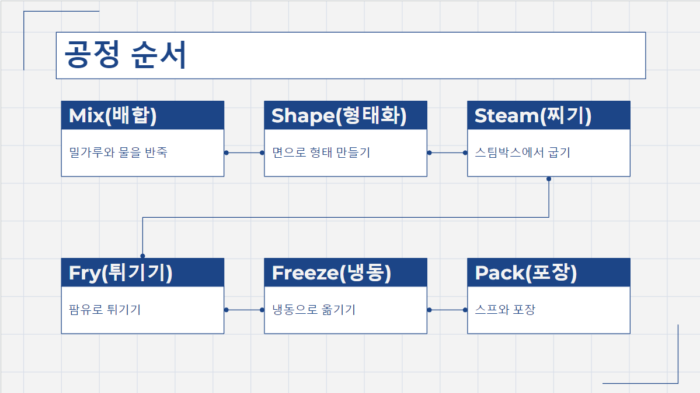
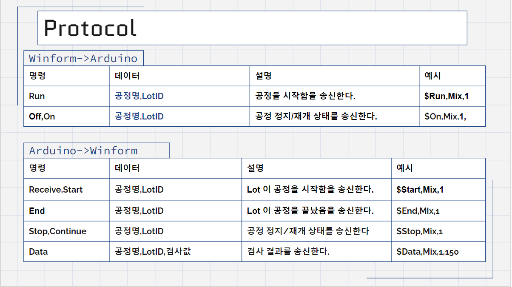
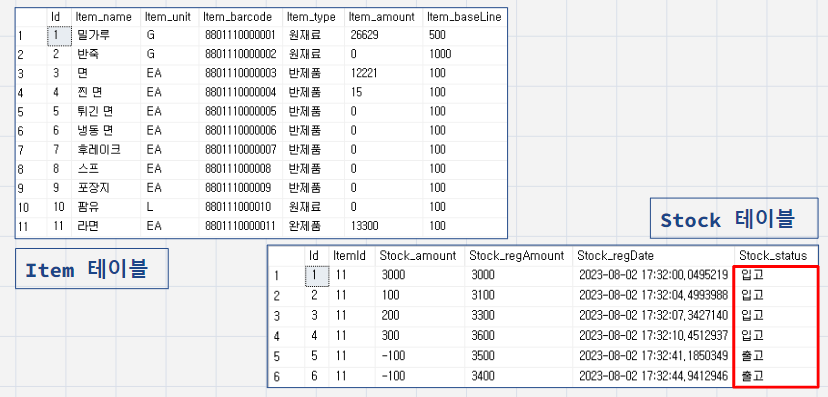
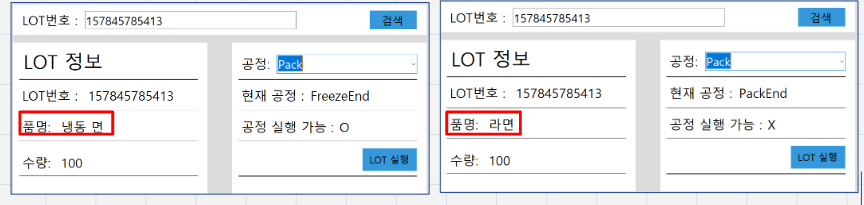
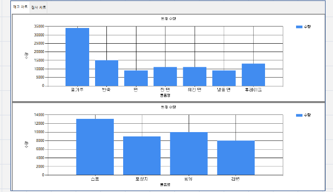
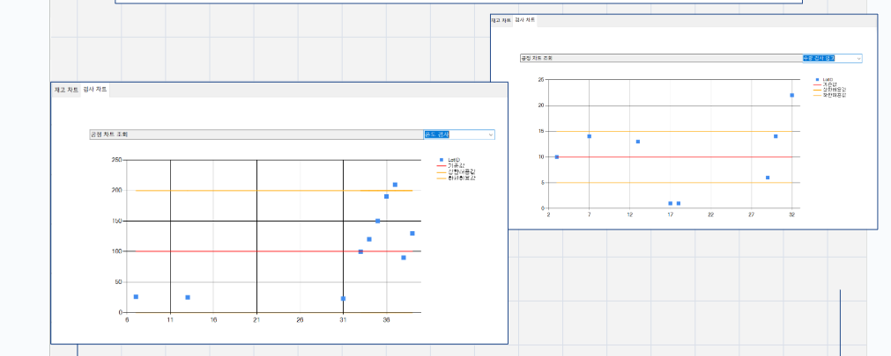

# **라면 공장 스마트팩토리 MES WinForm & Arduino**

 

### **[ 시연 & 발표영상 Link ]**

 

[시연 & 발표영상 Link]: https://www.youtube.com/watch?v=EIa28L82daU&list=PLedGoSru794-VINQHqtNmjeTm0uuZJ1Ck&index=1&ab_channel=MasterCode

## **개요**
- 소프트웨어, 하드웨어 , 데이터베이스간 실시간 데이터 연동과 PC와 하드웨어간 Serial 통신이 가능한 MES 시스템
- 통신한 데이터들을 데이터베이스에 저장하고 WinForm과 WEB에서 차트로 시각화하여 보여줌.

## **공헌한 내용**
- 기여도 35%
- 데이터베이스 설계 및 관리
- 재고의 입고 , 재고 이력조회
- LOT이 공정이 진행될 때 LOT의 물품 상태 변화
- 상태변화에 따른 재고의 수량 변화
- 주문이 들어왔을때의 주문 추가
- 주문이름을 통한 재고의 출고
- WinForm에서의 재고 차트로 시각화
- WinForm에서의 검사 데이터들 차트로 시각화

## **개발 환경 및 활용 기술**
C#, ASP.NET, Winform, Arduino, Entity FrameWork

## 발표자료 PPT

## **공정 구현에 사용된 입출력 장치**

|부품명|사용 개수|사용 목적|
|---|---|---
|DHT11 온습도센서|1| 스팀기의 온도 검사
|Water Level Sensor|1|팜유의 용량 검사
|HC-SR04 초음파 센서|2|입출고시 LOT 개수 검사
|I2C LCD|1|공정 현황 실시간 표시
|LED_RED 빨간색|6|공정 정지시 점등
|LED_GREEN 초록색|6|공정 대기시 점등
|LED_YELLOW 노란색|6|공정 진행시 점등

### **시스템 설계도**

- 하드웨어와 소프트웨어간의 통신이 가능하게 구현
- WinForm이나 통신을 통한 데이터들을 DB에 저장하도록 구현
- 데이터들을 WinForm이나 WEB에서 차트로 시각화
 

### **공정**

 

### **Serial Protocol**

 

### **재고관리 테이블 설계**

- 재고량과 적정재고량 단위등을 기록할 수 있는 Item 테이블과 입,출고를 나타내고 변화량과 변화당시 수량을 기록할 수 있는 Stock테이블로 나누어 설계
 

### **LOT 진행 시 아이템 변화**

- 포장공정에서 냉동면을 포장하게 되면 완제품으로 바뀌도록 구현.
 

### **주문**

- 주문을 받았을 때 주문이름을 통해 출고가 가능하며 출고되면 출고 날짜가 기록되도록 구현.
 

### **차트**

- 재고량에 대한 정보를 차트로 시각화
- 검사기준값과 오차값 검사값들을 통해 검사의 오차값과 오차의 상한,하한선을 표시하고 상,하한선을 넘어간 데이터들은 불량임을 알 수 있도록 차트로 시각화.
 